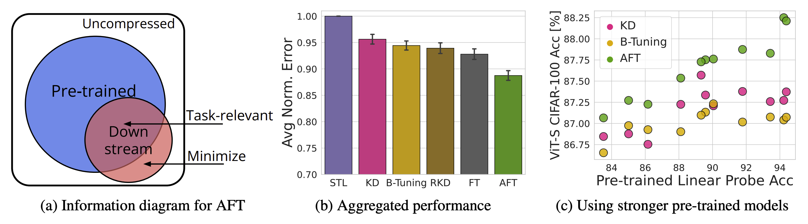

# Transferring Knowledge from Large Foundation Models to Small Downstream Models
This repository contains the code for the paper [Transferring Knowledge from Large Foundation Models to Small Downstream Models]() by Shikai Qiu, Boran Han, Danielle C. Maddix, Shuai Zhang, Yuyang Wang, and Andrew Gordon Wilson.

<figure>
  
</figure>

Adaptive Feature Transfer (AFT) transfers knowledge from large foundation models into small downstream models, improving downstream performance with minimal cost. (a) AFT regularizes the downstream model to prioritize learning the task-relevant subset of pre-trained features ($\mathrm{blue} \cap \mathrm{red}$) over entirely new features ($\mathrm{red} \setminus \mathrm{blue}$). Blue region represents information in pre-trained features, red represents information in downstream features, and inside the square boundary represents all information in the raw, uncompressed input. (b) Over 6 vision datasets and 8 NLP datasets, AFT significantly outperforms standard transfer learning, knowledge distillation, and B-Tuning. Error is normalized by that achieved with standard transfer learning and averaged over datasets and downstream models, including ViT-S, MLP Mixer-B, ResNet-50, BERT-S, and DistillBERT. (c) AFT is the most effective at translating improvements in pre-trained models to improvements in downstream performance.

Please cite this work as:
```bibtex
@article{qiu2024transfer,
    title={{Transferring Knowledge from Large Foundation Models to Small Downstream Models}},
    author={Shikai Qiu, Boran Han, Danielle C. Maddix, Shuai Zhang, Yuyang Wang and Andrew Gordon Wilson},
    year={2024}
}
```

## Setup
To setup the environment, simply run
```
sh setup.sh
```
to install the required packages inside a conda environment named `aft`.

Then, run
```
conda activate aft
```
to activate the environment.

## Running AFT
All our experiments are run using the `run.py` script with appropriate arguments specifying the downstream model, pre-trained model(s), dataset, and method, etc. For example, to run the proposed `aft` with a regularization strength $\beta=10$ on the `cifar10` dataset with a ViT-S as downstream model and both ViT-G DINOv2 and ViT-G CLIP as pre-trained models

```
method=aft
ds=cifar10
pretrained_models=vit_giant_patch14_dinov2.lvd142m,vit_giant_patch14_clip_224.laion2b
model=vit_small_patch16_224.augreg_in1k
lr=1e-4
prec=10
seed=0
python run.py \
--seed=${seed} \
--model_class=${model} \
--init_model=${model} \
--dataset=${ds} \
--pretrained_models=${pretrained_models} \
--train_frac=1 \
--use_val=False \
--method=${method} \
--prec=${prec} \
--learn_scales=True \
--steps=5000 \
--eval_steps=500 \
--optimizer=adam \
--batch_size=128 \
--lr=${lr} \
--wd=0 \
--no_augment=True \
--use_wandb=False
```

As shown in the above example, when transferring from multiple pre-trained models, we simply concatenate the names of the pre-trained models with a comma. Prior to running AFT, make sure you compute and save the features of the pre-trained models on the downstream dataset, which is done by running (taking ViT-G DINOv2 and CIFAR-10 as an example)
```
pretrained_model=vit_giant_patch14_dinov2.lvd142m
dataset=cifar10
save_path="./features/${model}_${dataset}.pt"
python save_features.py \
--model_class=${pretrained_model} \
--dataset=${dataset} \
--save_path=${save_path}
```
More examples can be found in `examples/run.sh` and `examples/save_features.sh`. 

When tuning hyperparameters, pass `use_val=True` so the model is evaluated on the validation constructed from holding out 10% of the training set.

## Baselines
To run knowledge distillation instead, simply set `method=kd` and adjust `prec` to set the corresponding regularization strength $\beta$. Similarly, to run [B-Tuning](https://arxiv.org/abs/2110.10545), set `method=btune`. Before running B-Tuning, we need to compute [LogME](https://github.com/thuml/LogME/tree/main) scores. For example, if we train on CIFAR-10 with ViT-S as downstream model and ViT-G DINOv2 as the pre-trained model, run the following command after you have computed the features for both ViT-S and ViT-G DINOv2 on CIFAR-10:
```
dataset=cifar10
for model in vit_small_patch16_224.augreg_in1k vit_base_patch14_dinov2.lvd142m; do
    python logme.py \
    --model_class=${model} \
    --dataset=${dataset}
done;
```

To run standard transfer learning, set `method=init`.

## Models
Here's a table that map model names as used in the paper and the corresponding names that should be used in the code base.

| Model Name in Paper              | Model Name                       |
|---------------------------------|----------------------------------|
| STL (no pretrained features)                              | none                             |
| ResNet-50                        | resnet50.a1_in1k                 |
| Mixer-B                          | mixer_b16_224.goog_in21k_ft_in1k |
| ViT-S                            | vit_small_patch16_224.augreg_in1k|
| ViT-L DINO                       | vit_large_patch14_dinov2.lvd142m |
| ViT-G CLIP                       | vit_giant_patch14_clip_224.laion2b |
| ViT-G DINO                       | vit_giant_patch14_dinov2.lvd142m |
| ViT-L CLIP                       | vit_large_patch14_clip_224.laion2b |
| ViT-H CLIP                       | vit_huge_patch14_clip_224.laion2b |
| ViT-S DINO                       | vit_small_patch14_dinov2.lvd142m |
| ViT-B DINO                       | vit_base_patch14_dinov2.lvd142m  |
| BiT 50x1                         | resnetv2_50x1_bit.goog_in21k     |
| BiT 50x3                         | resnetv2_50x3_bit.goog_in21k     |
| BiT 101x1                        | resnetv2_101x1_bit.goog_in21k    |
| BiT 101x3                        | resnetv2_101x3_bit.goog_in21k    |
| BiT 152x2                        | resnetv2_152x2_bit.goog_in21k    |
| BiT 152x4                        | resnetv2_152x4_bit.goog_in21k    |
| FlanT5-S                         | google/flan-t5-small             |
| FlanT5-B                         | google/flan-t5-base              |
| FlanT5-L                         | google/flan-t5-large             |
| GPT-2 S                          | gpt2                             |
| GPT-2 M                          | gpt2-medium                      |
| GPT-2 L                          | gpt2-large                       |
| GPT-2 XL                         | gpt2-xl                          |
| BERT Small                       | prajjwal1/bert-small             |
| DistilBERT                       | distilbert-base-uncased          |
| LLaMA 7B                         | meta-llama/Llama-2-7b-hf         |
| LLaMA Chat 7B                    | meta-llama/Llama-2-7b-chat-hf    |
| CLIP ResNet50 for SNLI-VE        | CLIP                             |

## Security

See [CONTRIBUTING](CONTRIBUTING.md#security-issue-notifications) for more information.

## License

This project is licensed under the Apache-2.0 License.